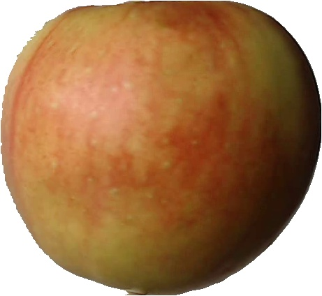

# Artificial Image Generation
Synthetic image generation of fruits using Generative Adversarial Network(GAN) model. This code provides the model for generation of images of apples and calculate the FID score for the generated images.

Wasserstein GAN with Gradient Penalty is used to generate the images. Traditional GAN uses a loss function involving binary cross entropy loss function which can have close to zero gradient at some regions. Compared to that gradients of WGAN with gradeint penalty has better gradients which help in faster learning of the model.

A few samples of the input images are,<br/>




Images were generated with FID Score of 61. Samples of the generated images are: <br/>


The FID score could be improved using hyperparameter tuning, which requires high computational resources. :disappointed:

For installing required libraries run, 
```
cd apple_images
pip install - r requirements.txt
```
For training and generation of images, run:
```
python3 main.py
```
Generated images are stored in output/generated_images/apples. The input data can be changed by adding other input data in the folder, input_data/input_images.

## References
<a id="1">[1]</a> Ian J. Goodfellow and Jean Pouget-Abadie and Mehdi Mirza and Bing Xu and David Warde-Farley and Sherjil Ozair and Aaron Courville and Yoshua Bengio, Generative Adversarial Networks, 2014, https://arxiv.org/abs/1406.2661 <br/>
<a id="1">[2]</a> Martin Arjovsky and Soumith Chintala and Léon Bottou, Wasserstein GAN, 2017, https://arxiv.org/abs/1701.07875 <br/>
<a id="1">[3]</a> Ishaan Gulrajani and Faruk Ahmed and Martin Arjovsky and Vincent Dumoulin and Aaron Courville, Improved Training of Wasserstein GANs, 2017, https://arxiv.org/abs/1704.00028

