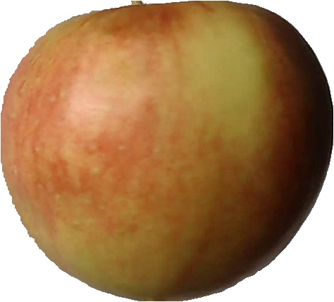
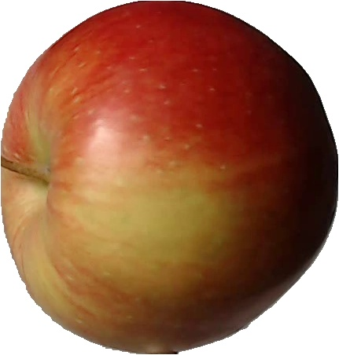
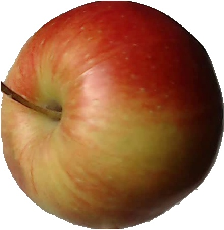
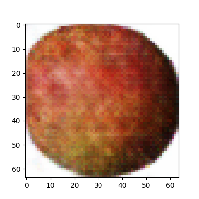
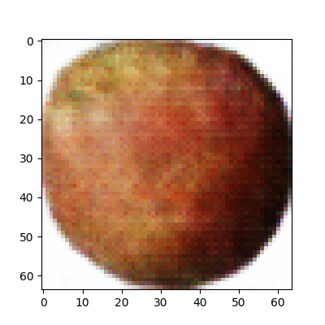
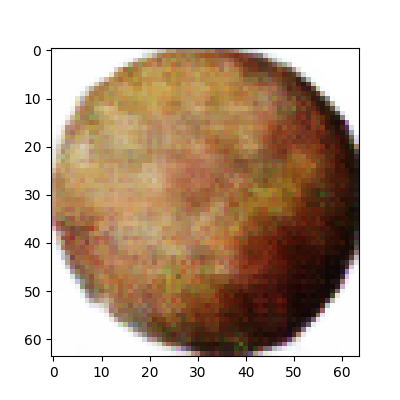

# Artificial Image Generation
Synthetic image generation of fruits using Generative Adversarial Network(GAN) model. This code provides the model for generation of images of apples and calculate the FID score for the generated images.

A few samples of the input images are,<br/>




Images were generated with FID Score of 61. Samples of the generated images are: <br/>




The FID score could be improved using hyperparameter tuning, which requires high computational resources. :disappointed:

For installing required libraries run, 
```
cd apple_images
pip install - r requirements.txt
```
For training and generation of images, run:
```
python3 main.py
```
